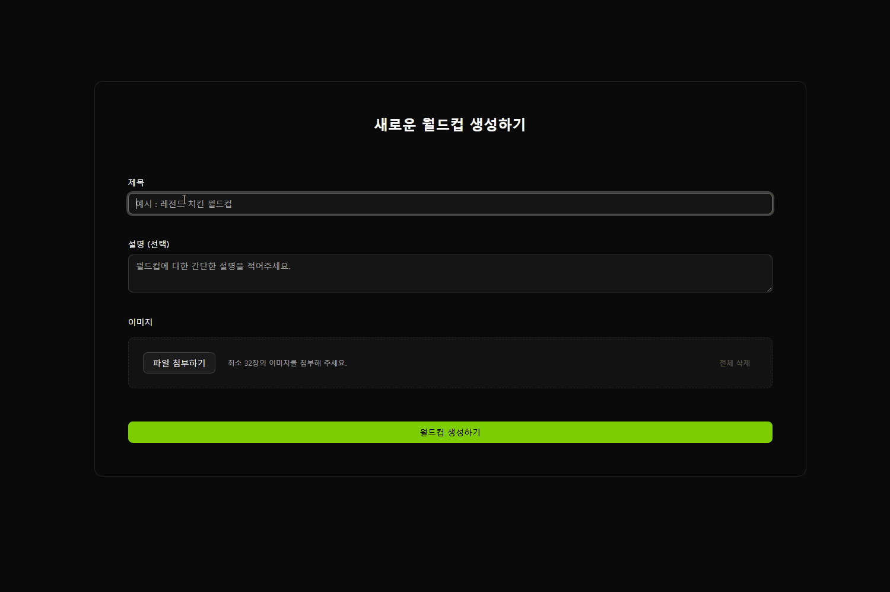
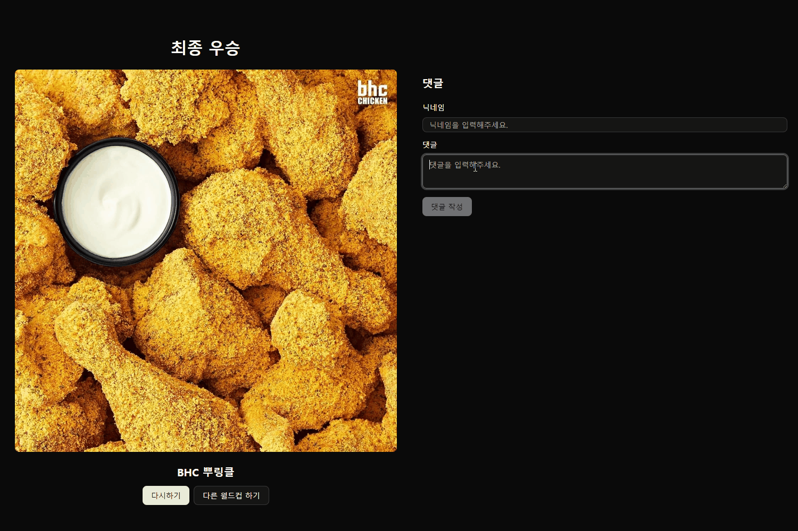

# 🏆 Ideal World Cup (이상형 월드컵)
 

## 📌 프로젝트 기획 배경

* **트렌드 분석 :** 대중들은 MBTI 테스트와 같이 **가볍게 참여하고 결과를 공유**하는 콘텐츠에 높은 반응을 보인다는 점에 착안했습니다.
* **핵심 목표 :** 단순한 토이 프로젝트를 넘어, **'참여와 공유'가 자연스럽게 연결되는 선순환 구조**의 실사용자 기반 웹 서비스를 구축하고자 시작했습니다.
* **콘텐츠 선정 :** 이러한 목표를 가장 잘 구현할 수 있는 콘텐츠로, 다양한 주제의 토너먼트 게임을 즐기는 **이상형 월드컵**을 채택했습니다.
* **확산 설계 :** 사용자가 게임 결과를 공유할 수 있도록 구현하여, **하나의 참여가 새로운 유입으로 이어지는 바이럴(Viral) 마케팅 구조**를 기획했습니다.

**▶️ 본 프로젝트는 사용자 중심의 가치를 실현하고자 출발했으며, 현재 핵심 로직 구현을 마무리하는 단계에 있습니다.**

  

## 🖼️ 주요 기능 시연

|  | 서비스 화면 |
| :--- | :--- |
| **생성** |  |
| **게임** |  |
| **결과** |  |

  

# ✨ 핵심 기술 스택

### 💻 프론트엔드

| 분류 | 기술 스택 |
| :--- | :--- |
| **언어** |   |
| **프레임워크** |   |
| **스타일링/UI** |   |

### ⚙️ 백엔드 및 DB

| 분류 | 기술 스택 |
| :--- | :--- |
| **런타임 / 프레임워크** |   |
| **API / DB** |   |

  
